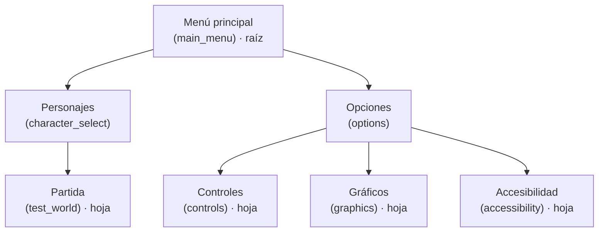

<div align="center">

# RUMBLENET

**Party game 3D low poly para promover el uso saludable de las redes sociales**


Estructura de Datos II · Universidad del Norte

</div>

---

## Información del proyecto

| Campo | Detalle |
|---|---|
| **Asignatura** | Estructura de Datos II |
| **Institución** | Universidad del Norte, Departamento de Ingeniería de Sistemas y Computación |
| **Entrega** | Primera entrega, semana 8 (14 al 18 de septiembre de 2026): estructuras de árboles e interfaz gráfica |
| **Motor y lenguaje** | Godot 4.7 · GDScript |
| **Integrantes** | Isaac Monterrosa Guzmán · Axel Tornay · Juan Diego Vizcaino · Maria Del Mar Yusti |

---

## Descripción del juego

RumbleNet es un party game multijugador en 3D de estilo low poly, diseñado para jóvenes y centrado en partidas cortas, dinámicas y competitivas. Los jugadores participan en retos que ponen a prueba su rapidez, habilidad y capacidad de tomar decisiones en entornos cambiantes.

| Característica | Detalle |
|---|---|
| Género | Party game / multijugador |
| Público objetivo | Jóvenes |
| Jugadores | De 1 a 4 |
| Estilo visual | 3D low poly |
| Partidas | 4 rondas rápidas de 1,5 a 2 minutos |

### Objetivo y enfoque

El juego promueve hábitos de consumo digital responsable mediante retos interactivos relacionados con la gestión del tiempo, las interacciones positivas y el bienestar digital.

Los jugadores compiten en minijuegos que representan situaciones de la vida digital: administrar el tiempo frente a una pantalla, priorizar actividades o evitar comportamientos negativos en entornos virtuales. El aprendizaje ocurre a través de la mecánica del juego, sin preguntas explícitas.

### Dinámica del juego (diseño)

- Cada partida tiene 4 rondas, y cada ronda presenta un mapa o entorno diferente.
- Las reglas y los obstáculos pueden variar entre rondas, y cada ronda tiene su propio sistema de puntuación.
- **Multijugador (modo principal):** de 1 a 4 jugadores compiten simultáneamente. Al final de cada ronda se muestran los puntos acumulados y se actualiza la posición de cada participante. Tras las cuatro rondas se calcula la puntuación total y se presenta una tabla de posiciones con animación de podio.
- **Modo individual:** el jugador participa en los mismos retos y compite por conseguir la mayor puntuación.

---

## Estado de la primera entrega

| Componente | Estado |
|---|---|
| Árbol general de pantallas (`ScreenTree` y `ScreenFlow`) | Implementado |
| Interfaz gráfica: menú principal, opciones y selección de personaje | Implementado |
| Componente inclusivo: filtros de daltonismo | Implementado |
| Jugador 3D y mundo de pruebas con menú de pausa | Implementado (preliminar) |
| Modelos 3D de Rayo, Planta y Agua | Pendiente (aparecen bloqueados en el selector) |
| Rondas, mapas, obstáculos aleatorios y puntajes | En desarrollo |
| Herramienta de ayuda del juego | Parcial (pantalla de Controles) |
| Grafos integrados a la mecánica | Segunda entrega |
| Multijugador local cliente-servidor y podio | Entrega final |

---

## Primera entrega: aplicación de árboles

El componente de árboles es un **árbol general que modela toda la navegación entre pantallas del juego**. A continuación se responde, en orden, qué problema resuelve, por qué se eligió esa variante y cómo se recorre.

### Qué problema resuelve

RumbleNet tiene varias pantallas encadenadas: del menú principal se pasa a la selección de personaje y de ahí a la partida, y desde Opciones se accede a Controles, Gráficos y Accesibilidad. El juego necesita saber **en qué pantalla está el jugador, a cuáles puede ir desde ahí y cómo volver**.

Sin una estructura, cada escena tendría que conocer a sus vecinas y agregar una pantalla nueva obligaría a modificar varios archivos. Con el árbol, esa información vive en un solo lugar.

### Por qué se eligió esta variante

- **La navegación es jerárquica:** el menú principal contiene a Opciones, y Opciones contiene a sus tres submenús.
- **Un nodo puede tener cualquier número de hijos** (Opciones tiene 3), por lo que un árbol binario no sirve. Se necesita un árbol general.
- **Cada pantalla tiene un único padre,** así que "volver" es subir un nivel, sin pila ni historial.
- **El árbol define la estructura del juego de antemano,** y los menús se generan a partir de él.

### Estructura del árbol



El árbol tiene 7 nodos, 4 hojas y una profundidad máxima de 2 niveles bajo la raíz.

### Cómo se recorre

`n` es el número de pantallas, `d` la profundidad de una pantalla y `k` el número de hijos de un nodo.

| Recorrido | Método | Qué hace | Complejidad |
|---|---|---|---|
| Descenso a los hijos | `children_of(id)` | Devuelve las pantallas hijas de un nodo. Opciones las recorre para crear sus botones. | O(k) |
| Ascenso al padre | `back()` | Sube un nivel siguiendo el enlace `parent`. | O(1) |
| Ascenso hasta la raíz | `path_to(id)` | Sigue los enlaces `parent` hasta la raíz y devuelve la ruta ordenada de raíz a pantalla. | O(d) |
| Preorden (DFS) | `preorder()` | Visita cada nodo antes que a sus hijos: Menú principal, Personajes, Partida, Opciones, Controles, Gráficos, Accesibilidad. Implementado y disponible para dibujar el árbol completo. | O(n) |
| Acceso directo | `find(id)` y `open(id)` | Llega a cualquier pantalla por su id usando un diccionario. | O(1) |

Construir el árbol también es O(1) por nodo: `add_root` y `add_screen` crean el nodo, lo enlazan a su padre y lo registran en el diccionario.

### Implementación

| Archivo | Clase | Responsabilidad |
|---|---|---|
| `scripts/data_structures/screen_tree.gd` | `ScreenTree` y `ScreenNode` | La estructura de datos: nodos, enlaces padre-hijos y operaciones sobre el árbol. |
| `scripts/autoload/screen_flow.gd` | `ScreenFlow` (Autoload) | Construye el árbol al iniciar y ejecuta la navegación real con `change_scene_to_file`. |
| `scripts/ui/screen.gd` | `Screen` | Clase base de cada pantalla: se identifica con su `screen_id` y maneja la acción de volver. |
| `scripts/ui/menu_page.gd` | `MenuPage` | Base de los submenús: muestra la ruta visible y el botón de volver. |

Cada `ScreenNode` guarda `id`, `title`, `scene_path`, `parent` y `children`. El árbol se arma una sola vez en `ScreenFlow._ready()`:

```gdscript
tree.add_root(&"main_menu", "Menú principal", "res://scenes/menus/main_menu.tscn")
tree.add_screen(&"main_menu", &"options", "Opciones", "res://scenes/menus/options_menu.tscn")
tree.add_screen(&"options", &"graphics", "Gráficos", "res://scenes/menus/graphics_menu.tscn")
```

### Cómo se observa el árbol en la interfaz gráfica

- **Ruta visible:** cada submenú muestra su camino, por ejemplo `Menú principal > Opciones > Gráficos`, calculado con `path_to`.
- **Menús generados por el árbol:** la pantalla de Opciones crea sus botones a partir de `children_of(&"options")`. El árbol decide qué aparece.
- **Volver:** todas las pantallas comparten `ScreenFlow.back()`, que sube al padre. La acción `menu_back` se maneja una sola vez en `Screen`.
- **Salir de la partida:** el menú de pausa usa `go_to_root()` para regresar al menú principal.

### Ejemplo de flujo

1. Desde el menú principal el jugador pulsa **Opciones** y `open(&"options")` carga esa escena.
2. Al iniciar, la pantalla llama `mark_current(&"options")` para que `ScreenFlow` sepa dónde está.
3. Opciones pide `children_of(&"options")` y genera los botones Controles, Gráficos y Accesibilidad.
4. El jugador entra a **Gráficos** y ve la ruta `Menú principal > Opciones > Gráficos`.
5. Al volver, `back()` sube a Opciones, y una segunda vez al menú principal.

### Cómo agregar una pantalla nueva

1. Crear la escena con un script que extienda `Screen` o `MenuPage`, y escribir su id en la propiedad **Screen Id** del Inspector.
2. Registrarla en `ScreenFlow._ready()` con `tree.add_screen(padre, id, título, ruta)`.
3. Abrirla con `ScreenFlow.open(&"id")`. Si es hija de Opciones, su botón aparece solo.

---

## Componente inclusivo y controles

**Accesibilidad:** desde *Opciones > Accesibilidad* se activa un filtro de daltonismo (protanopía, deuteranopía o tritanopía) aplicado con un shader sobre toda la pantalla. Solo se dibuja cuando hay un filtro activo. En *Opciones > Gráficos* también se puede cambiar el antialiasing (desactivado, 2x o 4x).

| Acción | Tecla |
|---|---|
| Moverse | `W` `A` `S` `D` |
| Saltar | `Espacio` |
| Mover la cámara | Mouse |
| Pausa | `Esc` |
| Navegar en menús | Flechas |
| Confirmar en menús | `Enter` o `Espacio` |
| Volver en menús | `Backspace` o `E` |

## Personajes y jugador

- **Personajes:** Fuego, Rayo, Planta y Agua, cada uno definido como un recurso `CharacterData` (nombre, color, retrato y modelo 3D). Los personajes sin modelo quedan bloqueados en el selector, y hoy solo **Fuego** está disponible.
- **Jugador:** `CharacterBody3D` con cámara en tercera persona sobre un `SpringArm3D`. El movimiento sigue la dirección de la cámara y el modelo alterna entre animación de reposo y de caminar.

---

## Tecnologías

**Godot Engine 4.7 y GDScript.** Se eligió Godot porque es gratuito y su lenguaje, GDScript, tiene una sintaxis similar a la de Python, lo que facilita aprenderlo frente a alternativas como Unity, que usa C#. El proyecto usa el renderizador Forward+ y el motor de física Jolt.

**Meshy.ai.** Se usó como herramienta de apoyo para generar los modelos 3D de personajes, obstáculos y elementos de los mapas a partir de referencias visuales y prompts, en estilo low poly. Luego los modelos se adaptan y optimizan para integrarlos al juego.

## Estructura del proyecto

```
rumblenet/
├── project.godot
├── assets/
│   ├── characters/          # modelos .glb y retratos (Fuego, Rayo, Planta, Agua)
│   └── ui/                  # fuente, iconos, cursor y shaders
├── resources/characters/    # CharacterData (.tres) de cada personaje
├── scenes/
│   ├── characters/          # jugador y modelo de Fuego
│   ├── levels/              # mundo de pruebas
│   ├── menus/               # una escena por cada pantalla del árbol
│   └── ui/                  # botón reutilizable
└── scripts/
    ├── autoload/            # GameState, ScreenFlow, ColorFilter, CustomCursor
    ├── characters/          # CharacterData y CharacterModel
    ├── data_structures/     # screen_tree.gd (árbol general de pantallas)
    ├── levels/              # lógica del mundo de pruebas
    ├── menus/               # scripts de cada pantalla
    ├── player/              # jugador, cámara y entrada
    └── ui/                  # Screen, MenuPage y GameButton
```

**Autoloads** (accesibles desde cualquier script): `GameState` (personaje elegido por jugador), `ScreenFlow` (navegación), `ColorFilter` (accesibilidad) y `CustomCursor`.

## Cómo ejecutar

**Requisito:** [Godot 4.7](https://godotengine.org/download).

1. Clonar el repositorio.
2. Abrir Godot, elegir **Import** y seleccionar el archivo `project.godot`.
3. Esperar a que termine la importación de recursos. La primera vez tarda porque la carpeta `.godot/` no se versiona.
4. Pulsar **F5**. La escena principal es `scenes/menus/main_menu.tscn`.

<!--
## Capturas
Agregar las imágenes en una carpeta `docs/` y descomentar:


-->

---

## Próximas entregas

| Entrega | Fecha | Alcance |
|---|---|---|
| Segunda | Semana 12 (19 al 23 de octubre de 2026) | Grafos integrados a la mecánica y visualización de su efecto en el juego. |
| Final | Semana 16 (16 al 20 de noviembre de 2026) | Integración de árboles y grafos, multijugador local cliente-servidor con sockets, herramienta de ayuda, sonidos y elementos motivadores. |
| VI Feria Gamer | 26 de noviembre de 2026 | Presentación del juego con pendón y evaluación de jugabilidad. |

## Créditos

- Fuente **Lilita One**, bajo licencia SIL Open Font License (ver `assets/ui/fonts/OFL.txt`).
- Modelos 3D generados con [Meshy.ai](https://www.meshy.ai) y adaptados por el equipo.
- Motor: [Godot Engine](https://godotengine.org).
